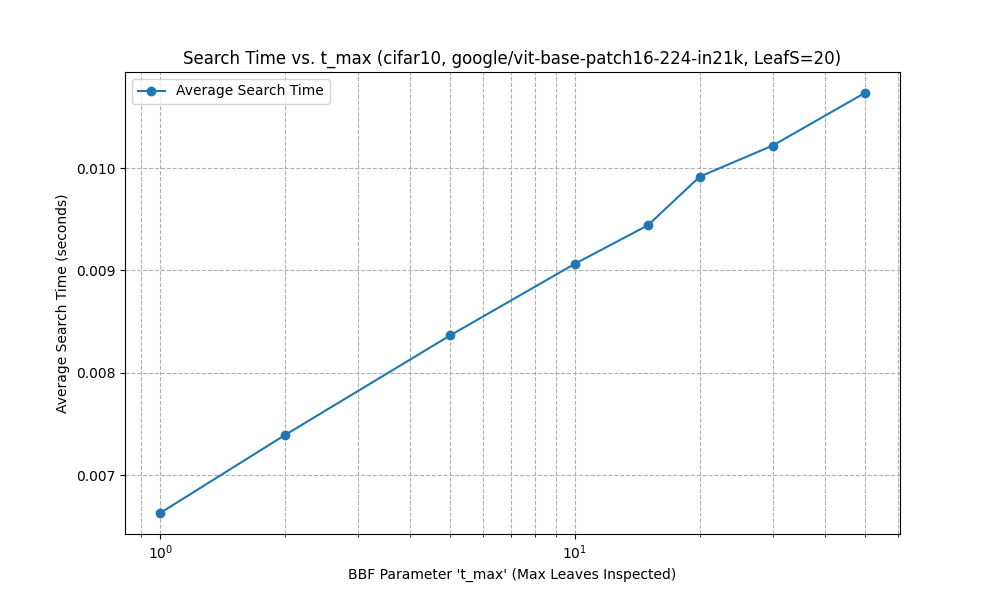
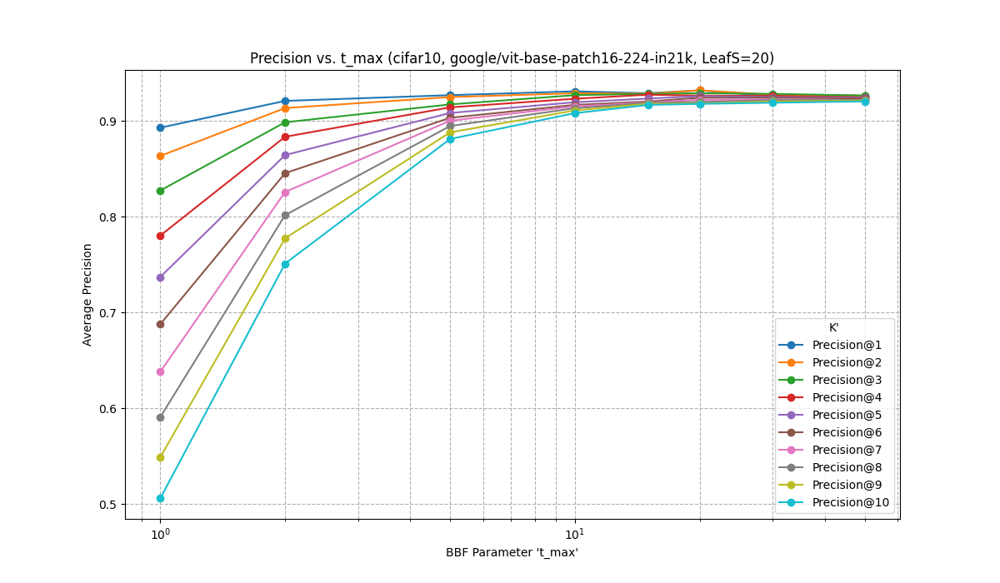
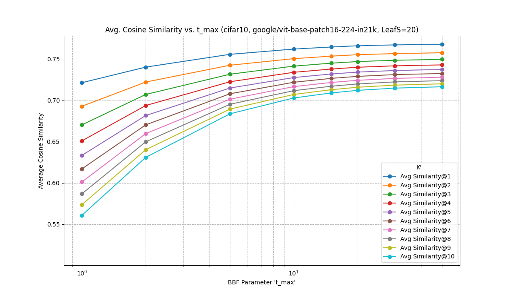

**实验报告：BBF算法在图像检索中的实现与性能评估**

本实验的全部代码开源在 <https://github.com/Nictheboy/college-alg-2-image-search>。

**摘要**

本实验旨在实现基于k-d树的Best Bin First (BBF) 近似最近邻搜索算法，并通过在图像特征数据集上调整其核心参数 `t`（最大搜索叶子节点数），评估其在搜索时间、检索精度和结果相似性方面的性能。实验使用了从CIFAR-10数据集中提取的图像特征，通过预训练的ViT模型进行向量化。结果表明，BBF算法的参数 `t` 显著影响其性能，较大的 `t` 值能带来更高的准确性和结果相似性，但相应地增加了搜索时间开销，体现了近似搜索算法中典型的时空/效率与效果的权衡。

**1. 引言**

在图像检索、推荐系统等众多应用中，高效地从大规模数据集中找到与查询点最相似的若干数据点（即k-近邻搜索）是一项核心任务。传统的精确搜索方法（如暴力搜索或标准k-d树在某些情况下的精确搜索）在数据维度较高或数据量巨大时，往往面临计算复杂度过高的问题。近似最近邻（ANN）搜索算法通过牺牲一定的精度来换取搜索效率的显著提升，BBF算法便是其中一种经典的基于k-d树的改进方法。它通过优先队列管理搜索路径，并限制检查的叶节点数量，从而在准确性和效率之间取得平衡。本实验将重点实现BBF算法，并探究其关键参数 `t` 对图像检索任务性能的影响。

**2. 实验方法**

在本实验中，尽管有建议采用 SIFT 或 ORB 等传统局部特征提取算法，并结合层次聚类方法构建视觉词典（如 Bag-of-Visual-Words 模型）进行图像表示，但我们最终并未采用这一路线。原因在于，传统方法虽在早期计算机视觉任务中具有一定效果，但其处理流程依赖多个独立步骤，包括特征提取、聚类、量化与直方图编码，整体效率较低，且容易在聚类阶段丢失细粒度语义信息。

我们选择采用的是近年来发展迅速的 Vision Transformer（ViT）架构，特别是 google/vit-base-patch16-224-in21k 模型。该模型将图像划分为固定大小的 patch，利用 Transformer 编码器直接学习全局特征表示，从而实现了端到端的图像向量化。与传统方法相比，ViT 不仅省去了手工构建视觉词典的步骤，更能通过自注意力机制建模图像中各区域之间的复杂依赖关系，极大提升了特征表达的语义完整性和可迁移性。

在具体实现上，我们的技术路线结合了高效的近似最近邻搜索方法。针对数据集部分，我们预先构建了 KD-Tree 索引结构，并在查询阶段采用 Best-Bin-First（BBF）策略，在 KD-Tree 上执行 Top-K 的近似最近邻（ANN）检索，以加速高维特征的匹配过程，提升整体系统的响应速度和可扩展性。

**2.1 数据集与特征提取**

* **数据集**：实验选用CIFAR-10图像数据集。为进行有效的近邻搜索，我们从中随机抽取了1000张图像作为构建k-d树的数据库（dataset部分），另抽取1000张图像作为查询集（query部分）。
* **特征提取**：采用预训练的深度学习模型 `google/vit-base-patch16-224-in21k` 对每张图像进行向量化，提取其高维特征（768维）。这些特征向量随后被L2归一化，以便后续使用欧氏距离（其平方与归一化向量的点积/余弦相似度相关）进行相似性度量。

**2.2 k-d树构建**

我们实现了一个自定义的k-d树构建算法。其核心思想如下：

1. 对当前节点包含的点集，选择一个切分维度（通常按深度循环选择）。
2. 沿该维度找到点集的中位数（或一个合适的分割点）。
3. 以该中位数点为基准，将点集划分为两个子集，分别构建左右子树。
4. 递归此过程，直到当前节点包含的点数小于或等于预设的 `leaf_size`（本实验中设置为20），此时该节点成为叶节点。
该k-d树结构支持后续BBF算法的欧氏距离计算。

**2.3 BBF搜索算法实现**

BBF (Best Bin First) 算法的核心思路是在k-d树上进行搜索时，不一定严格按照离分割超平面“更近”的路径深入，而是维护一个优先队列，优先访问那些其边界距离查询点更近的树节点（“bin”可以理解为叶节点或子树对应的空间区域）。
具体实现要求如下：

* **优先队列管理搜索路径**：使用一个最小堆（priority queue）来存储待访问的k-d树节点。节点的优先级由查询点到该节点对应区域边界的最小距离决定（距离越小，优先级越高）。
* **动态维护候选最近邻距离**：在搜索过程中，动态维护一个已找到的k个最近邻列表及其对应的最大距离（即第k远的邻居的距离）。这个距离用于剪枝：如果某个待访问节点的区域边界最小距离已经大于当前已找到的第k远邻居的距离，则该节点及其子树可以被安全地忽略。
* **最大搜索叶子节点数参数 `t`**：算法设置一个参数 `t_max`，限制在搜索过程中实际检查的叶子节点的最大数量。当检查的叶子节点数达到 `t_max` 时，搜索提前终止。这是BBF算法实现近似搜索和效率提升的关键。

**2.4 评估指标**

为了评估BBF算法在不同 `t` 参数下的性能，我们记录了以下指标：

* **单次查询平均时间 (Average Search Time)**：对于查询集中的每个查询向量，记录其BBF搜索所需时间，然后计算所有查询的平均时间。误差棒表示多次查询时间的标准差。
* **类别准确性 (Precision@K')**：对于每个查询图像，其真实类别已知。检索出的前K'个结果中，属于查询图像相同类别的比例，即为Precision@K'。我们针对K' = 1, 2, ..., K (本实验K=10) 分别计算，并对所有查询取平均值。误差棒表示多次查询对应Precision@K'的标准差。
* **平均余弦相似度 (Average Cosine Similarity@K')**：对于每个查询图像，计算其与检索出的前K'个结果特征向量之间的平均余弦相似度。然后对所有查询取平均值。由于特征向量已归一化，余弦相似度可以直接通过点积计算，且与欧氏距离相关（欧氏距离越小，余弦相似度越大）。误差棒表示多次查询对应Similarity@K'的标准差。

**2.5 实验设置**

* **数据集**：CIFAR-10 (1000训练样本，1000查询样本，包含10个类别)
* **特征提取模型**：`google/vit-base-patch16-224-in21k` (输出768维特征)
* **K-D Tree `leaf_size`**: 20
* **BBF `t_max` (T_VALUES)**：1, 2, 5, 10, 15, 20, 30, 50
* **检索邻居数 K**: 10
* **K' (用于评估)**: 1, 2, ..., 10

**3. 实验结果与分析**

我们对BBF算法在不同 `t_max` 参数下的性能进行了测试，结果通过三张图表展示。每张图中的评价指标的定义可以在2.4节中找到。

* **时间开销 vs. t_max (图1 - Search Time vs. t_max)**:
    
    如图1所示，平均搜索时间随着 `t_max` 值的增加而近似线性增长。这是符合预期的，因为更大的 `t_max` 意味着BBF算法需要探索和检查更多的叶子节点，从而导致更多的计算开销。当 `t_max` 从1增加到50时，平均搜索时间从约0.0066秒增加到约0.0107秒。这清晰地表明了 `t` 参数对搜索效率的直接影响。

* **Precision@K' vs. t_max (图2 - Precision vs. t_max)**:
    
    图2展示了不同K'值下的平均精确率随 `t_max` 变化的趋势。所有K'值的精确率都随着 `t_max` 的增加而提高，并在 `t_max` 达到一定值（例如10-20）后趋于平缓，增长幅度减小。例如，对于Precision@10，当 `t_max` 从1增加到5时，精确率从约0.506显著提升至0.881；而当 `t_max` 从20增加到50时，精确率仅从0.918略微提升至0.920。这说明在允许检查更多叶节点后，BBF算法更有可能找到与查询相关的正确类别，但当 `t_max` 超过某个阈值后，进一步增加 `t_max` 对精确率的提升效果变得有限，因为大部分相关的叶节点可能已经被访问过。

* **平均余弦相似度@K' vs. t_max (图3 - Avg. Cosine Similarity vs. t_max)**:
    
    图3显示了不同K'值下的平均余弦相似度随 `t_max` 变化的趋势，其模式与精确率图非常相似。随着 `t_max` 的增加，检索结果与查询向量之间的平均余弦相似度也随之提高，同样在 `t_max` 达到一定水平后增长趋缓。例如，对于Avg Similarity@10，当 `t_max` 从1增加到5时，相似度从约0.561提升至0.684；而从 `t_max` 为20时的0.712增加到 `t_max` 为50时的0.716，增幅很小。这表明，允许算法探索更多的叶节点，确实能够帮助找到与查询点在特征空间中更接近（即余弦相似度更高）的邻居。

**3.1 BBF算法的时空效率权衡分析**

实验结果清晰地展示了BBF算法在参数 `t` 控制下的时空效率权衡：

* **较小的 `t` 值**：导致更快的搜索速度（时间开销低），但牺牲了检索的准确性（精确率较低）和结果质量（平均余弦相似度较低）。这是因为算法被限制在较少的叶节点中寻找结果，可能错过包含更优匹配的叶节点。
* **较大的 `t` 值**：能够获得更高的精确率和平均余弦相似度，更接近精确搜索的结果，但代价是搜索时间的增加。当 `t` 值足够大，以至于覆盖了大部分或所有可能包含最近邻的叶节点时，其效果会逼近标准k-d树的精确搜索，但时间开销也相应增加。

在实际应用中，`t` 值的选择需要根据具体场景对搜索效率和结果质量的要求进行折中。如果应用场景对实时性要求极高，可以容忍一定的精度损失，则可以选择较小的 `t` 值。反之，如果对结果的准确性要求更高，则应选择较大的 `t` 值，并接受相应的时间开销。

**4. 结论与展望**

本实验成功实现了BBF近似最近邻搜索算法，并通过改变最大搜索叶子节点数 `t` 这一关键参数，在CIFAR-10图像特征数据集上对其性能进行了评估。实验结果验证了BBF算法通过参数 `t` 在搜索效率和检索效果之间进行权衡的有效性：增加 `t` 值可以提高检索精度和结果相似度，但会增加搜索时间。

未来的工作可以从以下几个方面展开：

* **与其他算法对比**：按照作业要求1.3，将BBF的性能与暴力搜索和标准k-d树精确搜索进行量化对比，特别是在准确率（如欧氏距离比值 ≤1.05视为成功）和内存占用方面。
* **不同维度数据集测试**：在不同维度的数据集上验证BBF算法的性能，并分析维度对准确率的影响（理论分析1.4.a）。
* **复杂度分析**：推导BBF的渐进时间复杂度，并与标准k-d树进行理论对比（理论分析1.4.b）。
* **参数优化**：探索k-d树的 `leaf_size` 参数与BBF的 `t_max` 参数之间的交互影响，寻找更优的参数组合。
* **更大规模数据集**：在更大规模的数据集上进行测试，以更全面地评估BBF算法的可扩展性和实用性。

**声明**

本实验报告的撰写及相关代码的实现，部分工作是在大型语言模型 Gemini (模型版本：Gemini 2.5 Pro Preview 05-06) 的辅助下完成的。模型主要在代码实现、调试、结果分析和报告撰写方面提供了帮助和建议。
